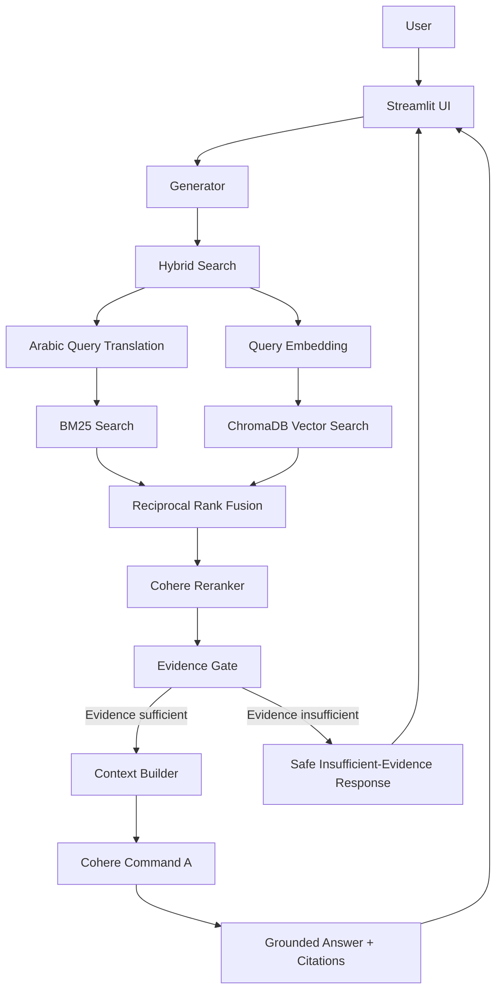
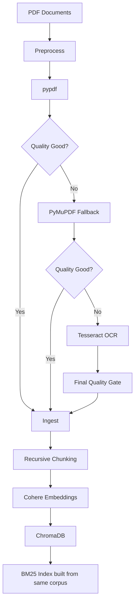

# QISO — System Architecture

## 1. نظرة عامة

**QISO** هو نظام **Retrieval-Augmented Generation (RAG)** متخصص في إدارة الجودة ومعايير ISO والتدقيق الداخلي.  
يعتمد النظام على استرجاع الأدلة من ملفات PDF أولًا، ثم استخدام نموذج لغوي لتوليد إجابة مبنية فقط على المصادر المسترجعة مع إظهار المصدر ورقم الصفحة.

الأهداف المعمارية الرئيسية:

- تقليل الهلوسة عبر إجابات مبنية على الأدلة.
- دعم الأسئلة بالعربية والإنجليزية.
- دمج البحث الدلالي **Vector Search** والبحث النصي **BM25**.
- إعادة ترتيب النتائج قبل التوليد باستخدام **Reranking**.
- الاحتفاظ بالمصدر والصفحة وبيانات الـChunk لضمان قابلية التتبع.
- فصل طبقة معالجة الوثائق عن طبقة الاسترجاع والتوليد وعن واجهة المستخدم.

---

## 2. المعمارية العامة



المسار الأساسي للسؤال هو:

```text
Question
   ↓
Query Processing
   ↓
Vector Search + BM25
   ↓
RRF Fusion
   ↓
Reranking
   ↓
Evidence Gate
   ↓
Context
   ↓
Cohere Generation
   ↓
Answer + Sources + Page Numbers
```

---

## 3. معمارية إدخال الوثائق Ingestion Architecture

تتم معالجة ملفات PDF قبل استخدامها في الاسترجاع.



### مراحل الإدخال

1. قراءة ملفات PDF من مجلد `docs/`.
2. محاولة استخراج النص باستخدام `pypdf`.
3. تطبيق **Quality Gate** على النص المستخرج.
4. استخدام `PyMuPDF` كـFallback عند انخفاض جودة الاستخراج.
5. استخدام **Tesseract OCR** عند الحاجة.
6. تمرير النص المقبول فقط إلى طبقة Ingest.
7. تقسيم الصفحات إلى Chunks بطريقة Recursive Character Chunking.
8. إنشاء Embeddings باستخدام Cohere.
9. تخزين النصوص والمتجهات والـMetadata في ChromaDB.
10. بناء BM25 من نفس الـChunks المخزنة في Chroma لضمان تطابق الـCorpus.

---

## 4. بنية المشروع

```text
QISO/
│
├── docs/
│   └── *.pdf
│
├── chroma_db/
│   └── Chroma persistent database
│
├── core/
│   ├── __init__.py
│   ├── preprocess.py
│   ├── ingest.py
│   ├── chunker.py
│   ├── embedder.py
│   ├── vector_store.py
│   ├── pipeline.py
│   ├── retriever.py
│   ├── bm25_search.py
│   ├── query_translator.py
│   ├── hybrid_search.py
│   ├── reranker.py
│   └── generator.py
│
├── ui/
│   ├── __init__.py
│   ├── components.py
│   ├── helpers.py
│   ├── layout.py
│   ├── sidebar.py
│   └── styles.py
│
├── .streamlit/
│   └── secrets.toml
│
└── streamlit_app.py
```

---

## 5. مسؤولية المكونات

| المكوّن | المسؤولية |
|---|---|
| `preprocess.py` | استخراج النص وفحص الجودة واستخدام PyMuPDF/OCR عند الحاجة |
| `ingest.py` | تحويل الصفحات المقبولة إلى سجلات موحدة مع Metadata |
| `chunker.py` | تقسيم النصوص إلى Chunks وتنظيف ضوضاء PDF بشكل محافظ |
| `embedder.py` | إنشاء Embeddings للوثائق والأسئلة باستخدام Cohere |
| `vector_store.py` | إدارة ChromaDB والتخزين والتحديث والتحقق من الـCorpus |
| `pipeline.py` | تنسيق دورة Ingest → Chunk → Embed → Store → Sync |
| `retriever.py` | تنفيذ Vector Retrieval من ChromaDB |
| `bm25_search.py` | تنفيذ Lexical Retrieval باستخدام BM25 |
| `query_translator.py` | ترجمة السؤال العربي إلى الإنجليزية لأغراض BM25 فقط |
| `hybrid_search.py` | دمج Vector وBM25 باستخدام RRF |
| `reranker.py` | إعادة ترتيب النتائج المرشحة باستخدام Cohere Rerank |
| `generator.py` | Evidence Gate، بناء السياق، التوليد، وإرجاع الإجابة والمصادر |
| `streamlit_app.py` | نقطة تشغيل واجهة الويب وربط المستخدم بخط RAG |
| `ui/*` | العرض، التنقل، السجل، المصادر، الإعدادات، والتنسيق |

---

## 6. Retrieval Architecture

يستخدم QISO **Hybrid Retrieval** بدل الاعتماد على أسلوب بحث واحد.

### Vector Search

يتم تحويل السؤال إلى Embedding ثم البحث داخل ChromaDB عن المقاطع الأقرب دلاليًا.

النموذج المستخدم:

```text
embed-multilingual-v3.0
```

ويتم استخدام:

```text
search_document  → عند فهرسة Chunks
search_query     → عند البحث بالسؤال
```

### BM25

يتم بناء فهرس BM25 من نفس الـChunks الموجودة داخل ChromaDB، مما يمنع وجود اختلاف بين Corpus البحث النصي وCorpus البحث المتجهي.

يفيد BM25 خصوصًا في:

- أرقام بنود ISO مثل `9.2`.
- أرقام المعايير مثل `9001:2015`.
- الكلمات والمصطلحات الدقيقة.
- العبارات التي يكون فيها التطابق النصي مهمًا.

### معالجة السؤال العربي

إذا كان السؤال بالعربية:

```text
Arabic Question
      ↓
Command A Translate
      ↓
English BM25 Query
```

الترجمة تستخدم فقط لمسار BM25.  
أما Vector Retrieval وReranking وتوليد الإجابة فتظل مرتبطة بالسؤال الأصلي.

### RRF Fusion

يتم دمج ترتيب نتائج:

```text
Vector Results + BM25 Results
```

باستخدام:

```text
Reciprocal Rank Fusion (RRF)
```

مع:

```text
RRF k = 60
```

ثم تزال النتائج المكررة بالاعتماد على `chunk_id`.

---

## 7. Reranking and Evidence Gate

بعد Hybrid Retrieval، تمر النتائج إلى:

```text
rerank-multilingual-v3.0
```

يتم اختيار أفضل النتائج النهائية قبل إنشاء السياق.

الإعدادات الافتراضية:

| الإعداد | القيمة |
|---|---:|
| Candidate K | 20 |
| Top K | 5 |
| Evidence Threshold | 0.05 |

إذا كانت أعلى نتيجة Rerank أقل من حد الأدلة، لا يتم إرسال سياق ضعيف إلى نموذج التوليد، بل يعيد النظام رسالة آمنة تفيد بأن المعلومات غير مدعومة بشكل كافٍ بالمصادر.

---

## 8. Generation Architecture

بعد نجاح Evidence Gate، يقوم النظام ببناء Context من أفضل المقاطع.

كل مصدر يحتوي على:

```text
Source Number
Source Filename
PDF Page
Chunk Text
Chunk ID
Retrieval / Rerank Metadata
```

ثم يتم إرسال:

```text
System Prompt
+
User Question
+
Retrieved Sources
```

إلى نموذج:

```text
command-a-03-2025
```

مع الإعدادات الأساسية:

```text
temperature = 0
max_tokens = 700
```

ويُطلب من النموذج:

- الإجابة من المصادر فقط.
- عدم استخدام معلومات خارجية.
- عدم اختراع بنود أو صفحات أو أسماء وثائق.
- الإجابة بنفس لغة السؤال.
- استخدام Citations مثل `[1]` و`[2]`.

---

## 9. واجهة المستخدم

تم بناء الواجهة باستخدام **Streamlit**.

الواجهة توفر:

- تسجيل دخول بسيط.
- طرح سؤال بالعربية أو الإنجليزية.
- عرض إجابة QISO.
- عرض المقاطع التي استخدمت كأدلة.
- اسم المصدر ورقم صفحة PDF.
- سجل لآخر الأسئلة في الجلسة.
- صفحة مستقلة للمصادر.
- إعدادات `top_k` و`candidate_k`.
- دعم اتجاهي RTL وLTR.
- واجهة Responsive للأجهزة المختلفة.

يتم الاحتفاظ بمحرك `Generator` داخل `Streamlit Session State` لإعادة استخدامه أثناء الجلسة بدل إعادة إنشائه مع كل تفاعل.

---

## 10. الإعدادات المعمارية الأساسية

| العنصر | القيمة |
|---|---|
| Chunking Strategy | Recursive Character Chunking |
| Chunk Size | 800 characters |
| Chunk Overlap | 120 characters |
| Embedding Provider | Cohere |
| Embedding Model | `embed-multilingual-v3.0` |
| Vector Database | ChromaDB |
| Collection | `qiso_docs` |
| Lexical Search | BM25 |
| Hybrid Fusion | RRF |
| RRF Constant | 60 |
| Candidate K | 20 |
| Final Top K | 5 |
| Reranker | `rerank-multilingual-v3.0` |
| Evidence Threshold | 0.05 |
| Generator | `command-a-03-2025` |
| Translation Model | `command-a-translate-08-2025` |
| Generation Temperature | 0 |
| Generation Max Tokens | 700 |
| Web UI | Streamlit |

---

## 11. Metadata Architecture

لا يخزن QISO النص فقط، بل يحتفظ ببيانات تسمح بتتبع مصدر كل Chunk.

من أهم حقول Metadata:

```text
source
source_hash
page
pdf_type
loader
quality
quality_score
ocr_used
extraction_status
pipeline_version
chunk_id
embedding_model
embedding_dimensions
```

يسمح ذلك بـ:

- معرفة الملف الأصلي.
- معرفة صفحة PDF.
- معرفة طريقة استخراج النص.
- تتبع جودة الصفحة.
- اكتشاف الـChunks المكررة.
- التحقق من تطابق نموذج Embedding.
- تحديث أو حذف مصدر محدد دون إعادة بناء كل قاعدة البيانات.

---

## 12. سلامة وتزامن البيانات

تم تصميم Pipeline بحيث يدعم حالات:

```text
ADD
SKIP
REPLACE
REPROCESS
DELETE
```

كما توجد فحوصات للتأكد من أن BM25 وChroma يستخدمان نفس الـChunks.

يمنع النظام أيضًا حذف كامل الـCorpus تلقائيًا إذا أصبح مجلد `docs/` فارغًا بشكل غير متوقع.

هذا يجعل عملية تحديث المصادر أكثر أمانًا من إعادة بناء قاعدة البيانات بصورة عمياء في كل تشغيل.

---

## 13. الأمن وإدارة الأسرار

مفتاح Cohere وبيانات تسجيل الدخول لا توضع داخل الكود.

يتم تحميلها من:

```text
.streamlit/secrets.toml
```

أو من متغيرات البيئة أثناء التطوير المحلي.

المبدأ المستخدم:

```text
Code
  ≠
Secrets
```

ولا يجب رفع ملفات الأسرار إلى GitHub.

نظام تسجيل الدخول الحالي خفيف ومناسب لنسخة QISO الحالية، لكنه ليس نظام IAM أو RBAC متكاملًا للمؤسسات.

---

## 14. Current Storage Snapshot

بحسب الفحص المحلي الحالي لقاعدة النظام:

```text
Chroma Collection: qiso_docs
Stored Chunks:     1553
```

هذا الرقم يمثل حالة قاعدة البيانات الحالية وقد يتغير عند إضافة أو حذف مصادر وإعادة تشغيل الـIngestion Pipeline.

---

## 15. خصائص الجودة المعمارية

### Groundedness

لا يولد النظام الإجابة مباشرة من السؤال، بل يسترجع الأدلة أولًا ثم يمررها للنموذج.

### Traceability

كل إجابة يمكن ربطها بالمصدر والصفحة والـChunk المستخدم.

### Retrieval Quality

دمج Vector Search وBM25 يقلل الاعتماد على نوع واحد من البحث.

### Multilingual Support

الـEmbedding والـReranking متعددَا اللغات، إضافة إلى مسار ترجمة مخصص لـBM25.

### Data Quality

Quality Gate وOCR Fallback يمنعان إدخال نصوص PDF منخفضة الجودة قدر الإمكان.

### Safety

Evidence Gate يسمح برفض توليد إجابة عندما تكون الأدلة المسترجعة غير كافية.

---

## 16. القيود الحالية

أهم القيود المعمارية في النسخة الحالية:

- السؤال العربي قد يحتاج عدة استدعاءات خارجية: Translation + Embedding + Rerank + Generation.
- الاعتماد على Cohere يجعل زمن الاستجابة متأثرًا بالشبكة وحدود الـAPI.
- Trial API Key قد يسبب `429 Too Many Requests` عند كثرة الطلبات.
- BM25 يحتاج إلى تهيئة الفهرس عند بدء الجلسة.
- ChromaDB يعمل كقاعدة Vector محلية، وهو مناسب للنسخة الحالية، لكن التوسع الكبير قد يتطلب بنية تخزين إنتاجية مختلفة.
- تسجيل الدخول الحالي بسيط ولا يوفر Roles أو إدارة مستخدمين مؤسسية.

هذه القيود لا تغير بنية RAG الأساسية، ويمكن تحسينها في الإصدارات المستقبلية.

---

## 17. الخلاصة

معمارية QISO تفصل النظام إلى أربع طبقات رئيسية:

```text
1. Document Processing
2. Retrieval & Ranking
3. Grounded Generation
4. User Interface
```

والتدفق النهائي هو:

```text
PDF Sources
   ↓
Quality-Controlled Ingestion
   ↓
Recursive Chunking
   ↓
Cohere Embeddings
   ↓
ChromaDB
   ↓
Hybrid Retrieval (Vector + BM25)
   ↓
RRF
   ↓
Cohere Rerank
   ↓
Evidence Gate
   ↓
Command A
   ↓
Grounded Answer + Citations
   ↓
Streamlit UI
```

بهذه البنية، يعطي QISO الأولوية لـ **جودة الأدلة، قابلية التتبع، ودقة الإجابة** بدل الاعتماد على التوليد المباشر من النموذج اللغوي.
